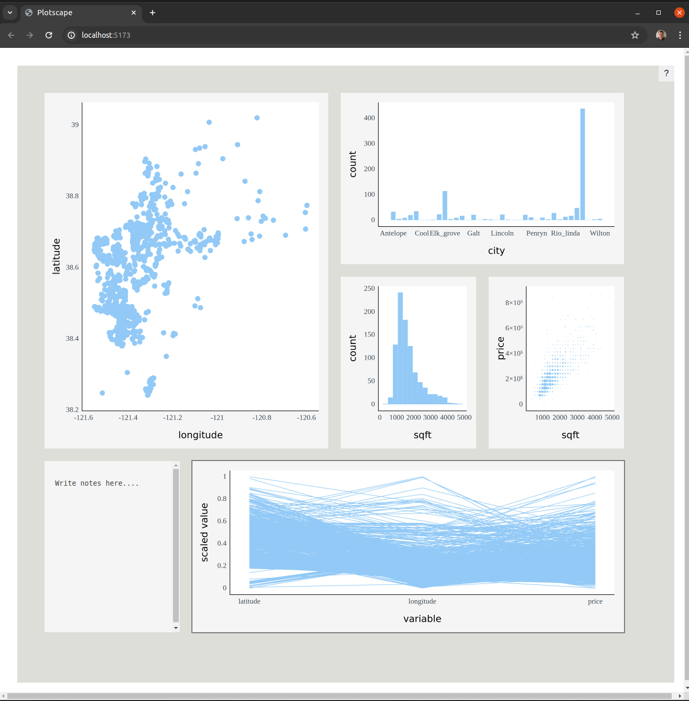

# Plotscape

Plotscape is a library for creating interactive figures, with support for features such as linked brushing,
representation switching, and interactive parameter manipulation.

This the landing page of a monorepo (a collection of related packages).

## Packages

- [plotscape](https://github.com/bartonicek/plotscape/tree/master/packages/plotscape): main TypeScript/JavaScript library.
- [utils](https://github.com/bartonicek/plotscape/tree/master/packages/utils): An internal utility package.

If you would like to use plotscape figures in R, go to [plotscaper](https://github.com/bartonicek/plotscaper) and follow the instructions there. If you want to make the figures for the Web, in TypeScript/JavaScript, then follow the instructions at [plotscape](https://github.com/bartonicek/plotscape/tree/master/packages/plotscape) for installing the corresponding `npm` package.

Happy data exploration!

