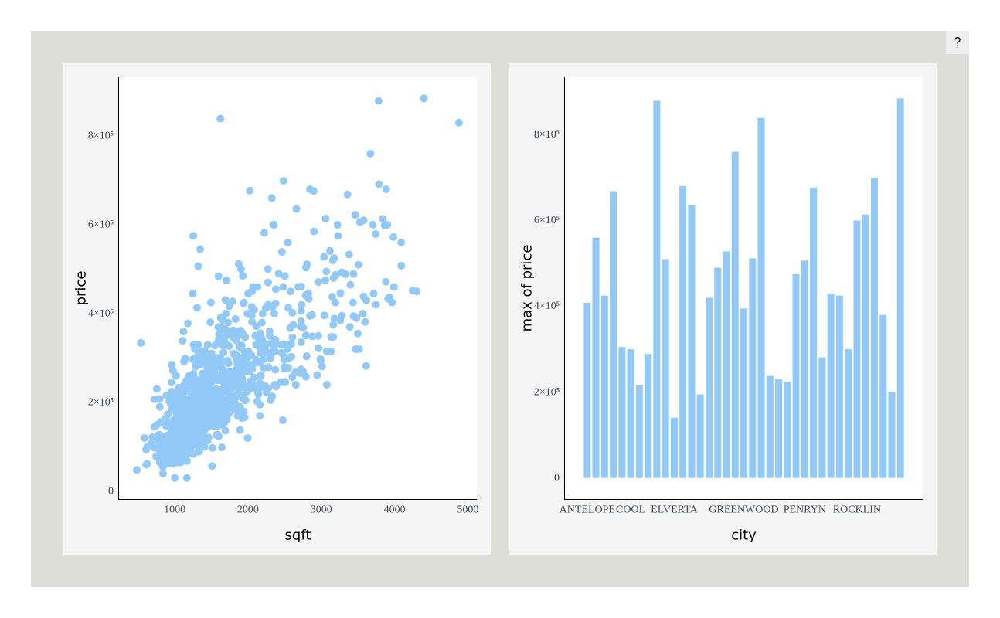
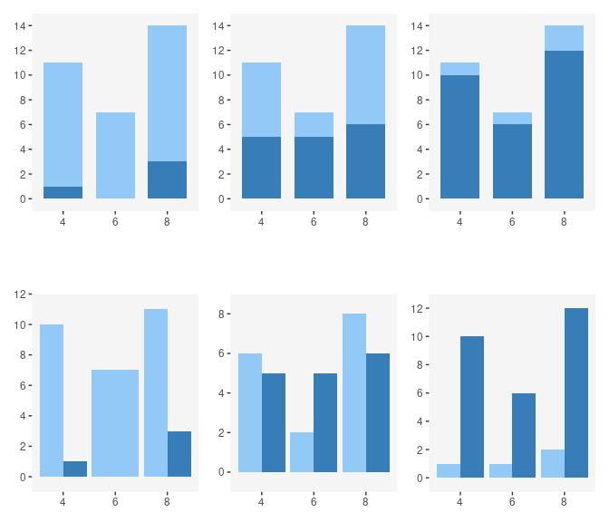

<!-- README.md is generated from README.Rmd. Please edit that file -->

# Plotscaper

<!-- badges: start -->
<!-- badges: end -->

Plotscaper is an R package designed for making interactive figures
geared towards data exploration. All plots in `plotscaper` figures
support linked selection, as well as wide variety of other interactions,
including parameter manipulation, zooming, panning, reordering, and
others.

## Quick start

To get started, install `plotscaper` with:

``` r
devtools::install_github("bartonicek/plotscape/packages/plotscaper")
```

Next, open up RStudio and run the following code:

``` r
library(plotscaper)

layout <- matrix(c(
  1, 1, 2, 3,
  1, 1, 4, 5,
  6, 7, 7, 7
), ncol = 4, byrow = TRUE)

set_scene(sacramento) |>
  add_scatterplot(c("longitude", "latitude")) |>
  add_barplot("city") |>
  add_histogram(c("sqft")) |>
  add_fluctplot(c("beds", "baths")) |>
  add_histogram2d(c("sqft", "price")) |>
  add_notes() |>
  add_parcoords(names(sacramento)) |>
  set_layout(layout)
```


In your viewer, you should now see something like the image above,
however, your version should be fully interactive (Github doesn’t allow
JavaScript in `README.md`, hence why the image above is static).

Try moving your mouse somewhere over the scatterplot in the top left of
the figure and clicking and dragging to select some points. You should
see the corresponding cases get highlighted across all the other plots!

There are many other ways interacting with `plotscaper` figures,
including:

- Zooming and panning
- Changing the size of objects
- Increasing/decreasing the opacity (alpha)
- Assigning selected cases to persistent groups
- Manipulating parameters such as histogram binwidth and anchor
- Modifying continuous axis limits
- Sorting and reordering discrete axes
- Resizing individual plots

Click on the question mark in the top right corner of the figure to see
the list of the available options plus the corresponding key/mouse
bindings.

## Anatomy of a `plotscaper` figure

There are a bunch of things going on in the code that was used to create
the figure above. Let’s walk through them step by step.

First, whenever we want to create a `plotscaper` figure, we need to set
up a scene, which is a kind of global context into which all of the
plots get placed. To set up a scene, run:

``` r
set_scene(data = sacramento)
```

where `data` is some `data.frame` object. Here we’re using the
Sacramento housing data set from the `caret` package.

If we run the code above, we will just get an empty rectangle. The
reason for that is that, in order to do some things, we first need to
fill the scene with plots. To populate the scene with plots, we can use
the `add_*` functions:

``` r
set_scene(sacramento) |>
  add_scatterplot(c("longitude", "latitude")) |>
  add_barplot("city")
```


The code above creates interactive figure with a linked scatterplot and
a barplot. We only need to specify which variables we want to show in
each plot by simple character vectors of their names. Simple as.

Under the hood, a `plotscaper` figure is just a `htmlwidgets` widget.
This means that, to render the figure, we need to print the underlying
object. More specifically, when we print a `plotscaper` scene,
`htmlwidgets` generates the underlying HTML, JavaScript, and CSS, and
sends it to the RStudio viewer (which is a kind of Web browser). This
operation is lazy - if we don’t print the object, nothing happens:

``` r
s <- set_scene(sacramento) |>
  add_scatterplot(c("longitude", "latitude")) |>
  add_barplot("city")
```

However, printing `s` generates the figure:

``` r
s # This is the same as print(s)
```


We can use this laziness to generate figures programmatically with R.
For example, here’s how we could create an interactive scatterplot
matrix (SPLOM) of the `Iris` dataset:

``` r

iris_smaller <- iris[, 1:3]
keys <- names(iris_smaller)

s <- set_scene(iris_smaller)

# Loop through columns
for (i in 1:3) {
  for (j in 1:3) {
    # Add a scatterplot if row & column no.'s are different
    if (i != j) s <- s |> add_scatterplot(c(keys[i], keys[j]))
    # Add a histogram if row & column no.'s are the same
    else s <- s |> add_histogram(c(keys[i])) 
  }
}

s
```


### Layout

We can control the figure layout by using the `set_layout` function.
This function works similarly to the `layout` function from the
`graphics` package. We just give the function a matrix of numeric values
representing the plot ids, and the figure automatically resizes the
plots based on how many equal-sized rectangles in a grid each plot takes
up.

For example, here’s how we can create a figure with large scatterplot on
the top-left, a tall histogram on the right-hand side, a short wide
histogram on the bottom, and a small section for notes (not-(e)-plot,
pardon the pun) on the bottom-right:

``` r

layout <- matrix(c(
  1, 1, 2,
  1, 1, 2,
  3, 3, 4
), ncol = 3, byrow = TRUE)

set_scene(sacramento) |>
  add_scatterplot(c("sqft", "price")) |>
  add_histogram("price") |>
  add_histogram("sqft") |>
  add_notes() |>
  set_layout(layout)
```


You can still resize individual plots by pressing and holding the `S`
key and then dragging a widget in the bottom right of the plot area.
Note, however, that this feature is a bit finicky and may result in
gaps.

## The algebra of highlighting

> This section delves into the deeper properties of `plotscaper`. If you
> are happy using the default figures to explore your data, feel free to
> skip it, however, you may still find it an interesting read.

When I started my PhD project, I wanted to create a framework for making
interactive graphics that would support certain types of interaction out
of the box. Specifically, I wanted every plot to support linked
selection, i.e. being able to click or click and drag some objects in
one plot and have all the corresponding cases get highlighted across all
other plots. The reason why I wanted to support linked selection is
because it allows you to quickly query different subsets of the data -
you select a few objects in one plot and immediately see the summaries
on that subset of the data - this makes it a really useful interactive
feature and a lot of data visualization researchers swear by it (see
e.g. Buja, Cook, and Swayne 1996; Heer and Shneiderman 2012; Ward,
Grinstein, and Keim 2015; Ware 2019). Anyway, alongside linked
selection, I also wanted to be able to support various kinds of plots
and statistical summaries, such that, if we were draw to draw a barplot,
we could make the bars display a different summary statistic (instead of
the usual counts), such as e.g. sums or means of some other variable.

This all sounds simple enough, right? However, I kept running into this
one issue, over and over again. I wanted all plots to support linked
selection and to be able to show different kinds of summaries. In doing
so, I wanted to treat the interaction (linked selection) and statistics
in the plots as two independent components. Unfortunately, this is not
how things work, and I kept hitting my head against the wall. However,
by doing so, I also eventually stumbled upon something that I think is
really interesting. I am now convinced that graphics, statistics, and
interaction are inextricably linked, in a deep, algebraic way, and, if
we want to create interactive data visualizations that look and behave
in sensible ways, we need to be aware of that. I hope I can convince you
too - let me start by laying out the problem I kept running into,
starting with some simple static plots.

### The problem

Try and see what’s wrong with the following plot:

``` r
theme_set(theme_bw() + 
            theme(panel.grid = element_blank(),
                  panel.border = element_blank(),
                  panel.background = element_rect(fill = "whitesmoke")))

ggplot(mtcars, aes(x = cyl, y = mpg, fill = am)) +
  geom_bar(stat = "summary", fun = mean) +
  scale_fill_manual(values = c("#92c9f6", "#377eb8")) +
  guides(fill = "none")
```



The plot above looks like something that might result from linked
selection, and, visually, it looks like a perfectly fine `ggplot2`
figure. However, take a close look at the following line:

``` r
geom_bar(stat = "summary", fun = mean)
```

We’re telling `ggplot2` that we want to draw bars by summarizing the
y-axis variable by its average, within the levels defined by the
Cartesian product of the `x` and `fill` variables (i.e. a table with `x`
as rows and `fill` as columns). However, there’s one important argument
that is applied to the function call, which is a `ggplot2` default that
we don’t see unless we specify it explicitly:

``` r
geom_bar(stat = "summary", fun = mean, position = "stack")
```

When using using the `fill` aesthetic with `geom_bar` (as well as other
`geom`s), `ggplot2` applies the stack transformation by default. In the
case of bars, this transformation stacks the bars vertically on top of
each other, effectively summing up the heights of the coloured sub-bars.

But herein lies the problem: what does the height of the stacked bars
represent now? Since stacking bars is effectively summing the underlying
statistic, each whole bar now represents the sum of the group averages.
That is not a meaningful summary statistic - “sum of averages” is not a
quantity that many people would care about or know how to interpret.
This is the kind of problem that can easily trip up a data visualization
rookie, and a good number of data visualization researchers have warned
about this:

> “Stacking is useful when the sum of the amounts represented by the
> individual stacked bars is in itself a meaningful amount” (Wilke 2019,
> 52).

> “\[…\] It is very important that if the element’s size is used to
> display a statistic, then that statistic must be summable. Stacking
> bars that represent counts, sums, or percentages are fine, but a
> stacked bar chart where bars show average values is generally
> meaningless.” (Wills 2011, 112).

Alright, you might say, I cannot sum averages, but since summing sums is
fine, what about taking an average of the averages? Unfortunately, this
is not correct either - the mean of group means is not the same as the
grand mean:

``` r
mean(1:3)
#> [1] 2
```

``` r
mean(mean(1:2), 3)
#> [1] 1.5
```

Some researchers have warned about this too:

> “\[…\] We do this to ensure that aggregate statistics are always
> computed over the input data, and so users do not inadvertantly
> compute e.g., averages of averages, which can easily lead to
> misinterpretation.” (Wu 2022)

So what should we do? If you’re familiar with `ggplot2`, you may be
thinking of one handy solution right now: instead of stacking the bars,
let’s use dodging and plot them side by side:

``` r
ggplot(mtcars, aes(x = cyl, y = mpg, fill = am)) +
  geom_bar(stat = "summary", fun = mean, position = "dodge") +
  scale_fill_manual(values = c("#92c9f6", "#377eb8")) +
  guides(fill = "none")
```


This works well for static graphics.

However, in interactive graphics, dodging has several issues. Take a
look at the following two rows of plots:



In both rows, we represent the same data; in the top row we use
stacking, in the bottom row we use dodging. We can imagine these
barplots being produced by linked selection, with the dark-blue bars
representing selected cases and more cases being selected as we move
from left to right. Notice that in the top row, the overall contour of
the plot remains constant even as the number of selected cases changes:
we always have a tall left bar, tall right bar, and a short middle bar,
and only the heights of the highlighted dark-blue sections fluctuate.

The same is not true for dodging. With dodging, since we plot the
selected and non-selected cases side-by-side, selection can affect the
overall shape of the plot dramatically - bars may shrink or grow, or
even pop and in out of existence (see left-most plot in the bottom row).

This may impact other parts of the plot too - see how the top y-axis
limits changes across the plots. Thus, if we want to implement selection
on a linked barplot with dodging, we have a tough choice over whether we
make the axes react in response to selection or not. If we make the axes
reactive then the user will be always able to see all of the data,
however, when selection happens, the axis limits reset and we lose the
context that they provide. If we don’t make the axes reactive, we risk
the bars growing outside of the plotting area. We don’t have to worry
about this in the case of the stacked barplot since selection does not
affect the height of the tallest bar.

Also, this is a bit of a subjective preference, but I find interactive
figures which change gradually more visually pleasing and easier to read
than figures in which objects fluctuate rapidly. I haven’t found much
research to support this claim more broadly. There is the article by
Hullman et al. (2013), who found that, when presenting sequences of
static graphics, people prefer the sequences where the plots change
gradually rather than abruptly.

### Sums preserve set union

So should we only ever do linked selection with sums and counts, so that
we can use stacking to highlight the selected cases? That seems a bit
limiting. But perhaps there’s another way.

In the quotes above, Wilke (2019) and Wills (2011) said that the
quantity represented by the stacked bar should be “meaningful”. What
does that mean?

Well, if I was to try to rephrase what Wilke and Wills were getting at,
I would say that sums are a particularly nice kind of summary statistic
because:

> *Sum* of grouped *sum*s is equal to the *sum* of everything.

In other words, we can take some sets of data, sum them up each
individually, and then sum up the sums, and we’ll get the same result as
if we had first combined those sets into one big set and summed that up.
In other words, sums preserve set union. This makes it possible to draw
highlighted parts of bars or other objects, because we know that if we
combine (sum) two sums, we’ll get a valid summary of the union of the
underlying cases of data.

Are there other statistics that behave this way? What if we replace the
word *“sum”* by a placeholder, for example *“foo”*:

> *Foo* of grouped *foo*s is equal to the *foo* of everything.

Then, it actually turns out there are other statistics that behave this
way. For example, the product of products is also a valid product of all
cases:

``` r
prod(2:4)
#> [1] 24
```

``` r
prod(prod(2:3), 4)
#> [1] 24
```

And likewise, the maximum of maximum is also the valid maximum for all
cases:

``` r
max(c(1, 2, 999))
#> [1] 999
```

``` r
max(max(1, 2), 999)
#> [1] 999
```

So how do we make this idea precise? Turns out there is a mathematical
concept that encapsulates this.

### Monoids

[“Monoid”]((https://en.wikipedia.org/wiki/Monoid)) sounds scary but it’s
really nothing complicated. It’s just three things:

- Some set $M$
- A binary operation $\otimes: M \times M \to M$
- A neutral element $e \in M$

Subject to two rules:

- Unitality: $x \otimes e = e \otimes x = x$
- Associativity: $x \otimes (y \otimes z) = (x \otimes y) \otimes z$

This means that, when we have a monoid, we have a bunch of things $M$
and a way of combining these things $\otimes$, such that, when we
combine these things, the order in which we do it doesn’t matter. We
also have some neutral element $e$, that, combined with anything else,
just yields the same thing back.

Typical examples of monoids include the above mentioned sums, products,
and maximums (here, the set $M$ is real numbers and the neutral units
are 0, 1, and $-\infty$ respectively). Counterexamples include the
above-mentioned means, as well as, for example, exponentiation (which
isn’t associative: $(x^y)^z \neq x^{(y^z)}$.

Monoids are a fundamental concept in abstract algebra and category
theory (see e.g. Fong and Spivak 2019; Lawvere and Schanuel 2009), and
are also heavily used in functional programming (see e.g. Milewski
2018). For our purposes, they important because they have the exact
property we were looking for - they preserve set union. Suppose we have
two disjoint subsets of some data $A, B \subseteq D$, and we can
summarize each with some monoidal summary F:

$$F(A) = a_1 \otimes a_2 \otimes \ldots \otimes a_n$$ That is, we just
take all elements in $A$ and *“sum”* them up together into one value
(where *“sum”* could be something else).

Now, if we summarize $A$ and $B$ and combine the summaries, we get the
same result as summarizing the union:

$$\begin{aligned} 
F(A) \otimes F(B) &= (a_1 \otimes a_2 \otimes \ldots a_n) \otimes (b_1 \otimes b_2 \otimes \ldots b_n) \\
&= a_1 \otimes a_2 \otimes \ldots a_n \otimes b_1 \otimes b_2 \otimes \ldots b_n \qquad \text{(associativity: brackets don't matter)} \\
&= F(A \cup B)
\end{aligned}$$

This means that, when we have monoids, we can compare nested subsets of
the data. Which is precisely what we want to do if we highlight some
cases in a plot: we want to compare the summary on the selected cases
($F(A)$) vs. that on everything ($F(A \cup B)$).

There are a few important caveats regarding comparison of multiple
selected groups and monotonicity. TODO

### Barplot of maximums

In `plotscaper`, if you know a little bit of JavaScript, you can use the
available plots to display monoidal summary statistics, using something
called reducers. To create a reducer, we need two things:

- An *initial* function: a function that produces the neutral element
  $e$
- A *reduce* function: a function that takes two values (in $M$) and
  combines them together, such that the operation is associative and
  unital

These currently need to be JavaScript functions.

For example, suppose we want to display the barplot of maximums for some
positive numeric variable. Then we can use the following JavaScript
arrow function as the initial function:

    () => 0

The function takes in no arguments and just produces the value zero. In
computer science lingo, this kind of “dumb” function is called a
[*thunk*](https://en.wikipedia.org/wiki/Thunk). In this case, the
function *could* technically just be a value, however, thunks are more
general, with the way how pointers work in JavaScript.

The one other thing we need is a reduce function:

    (x, y) => Math.max(x, y)

This is just a very simple function that takes two numbers and returns
the bigger one, using the built in `Math.max` JavaScript function.
That’s it.

You might be asking how do you know whether the operation that the
function does is associative and unital. You have to figure that out
yourself: try it out on a couple of candidate values & see if the
properties hold. `plotscaper` doesn’t know either - if you give it a
function that doesn’t have those properties it will still try to make an
interactive plot. It can’t know because it doesn’t know which values to
try; the properties could hold for a handful of numbers but not for
others. The functions behind it can actually support values other than
numbers, I haven’t tried to implement a plot like that yet but we’ll see
in the future.

Anyway, here’s how you can create a barplot of maximums in `plotscaper`:

``` r

library(htmlwidgets)

# Make the reducer - it really is just an R list() underneath
max_reducer <- reducer(
  name = "max",
  initialfn = "() => 0",
  reducefn = "(x, y) => Math.max(x, y)"
)

set_scene(sacramento) |>
  add_scatterplot(c("sqft", "price")) |>
  add_barplot(c("city", "price"), 
              options = list(reducer = max_reducer)) # Specify the reducer in plot options
```


Since maximum is a monoid, highlighting will work as expected! However,
only for one selected group: when multiple groups are selected, we may
not be able to see all of the bars; the reason for that is more math.
TODO

## Performance

While performance wasn’t a number one concern for `plotscaper`, it can
perform fairly well on moderately-sized data sets (thanks largely to the
work of the smart people who have optimized JavaScript engines like V8).

For example, if you want to put `plotscaper` to a stress test, try
creating a figure with the entire `diamonds` dataset from the `ggplot2`
package:

``` r
set_scene(ggplot2::diamonds) |>
  add_scatterplot(c("carat", "price")) |>
  add_fluctplot(c("cut", "color")) |>
  add_barplot(c("color"))
```


With 50,000 cases, dragging to select points in the scatterplot becomes
a bit sluggish on my machine, but still fast enough to make the figure
feel “interactive” rather than a “slideshow”. Your mileage may vary.
Note that most of the slowdown is due to rendering rather than
computation - removing the scatterplot with its 50,000 points makes the
interactions a lot snappier.

Frustratingly, there seems to be a small slowdown when interacting with
the figure in the RStudio Viewer rather than directly in the browser.
Interestingly, this does not seem to be related to the dataset size. I’m
not very familiar with the RStudio internals and have no idea why this
might be, but for now, if you want faster interactions I recommend just
opening up a browser window, e.g. by clicking the icon in the top right
of the viewer:


(if you know the reason behind this slowdown and/or how to fix it,
please email me at <abar435@aucklanduni.ac.nz>)

Anyway, if you need fast figures with larger data sets, I recommend
taking some of the following steps:

- Run the figure in the browser rather than viewer
- Use plots which summarize the data (e.g. barplots, 2D histograms),
  rather than plots which show all of the data points
- Take a subsample the data

# References

<div id="refs" class="references csl-bib-body hanging-indent">

<div id="ref-buja1996" class="csl-entry">

Buja, Andreas, Dianne Cook, and Deborah F Swayne. 1996. “Interactive
High-Dimensional Data Visualization.” *Journal of Computational and
Graphical Statistics* 5 (1): 78–99.

</div>

<div id="ref-fong2019" class="csl-entry">

Fong, Brendan, and David I Spivak. 2019. *An Invitation to Applied
Category Theory: Seven Sketches in Compositionality*. Cambridge
University Press.

</div>

<div id="ref-heer2012" class="csl-entry">

Heer, Jeffrey, and Ben Shneiderman. 2012. “Interactive Dynamics for
Visual Analysis: A Taxonomy of Tools That Support the Fluent and
Flexible Use of Visualizations.” *Queue* 10 (2): 30–55.

</div>

<div id="ref-hullman2013" class="csl-entry">

Hullman, Jessica, Steven Drucker, Nathalie Henry Riche, Bongshin Lee,
Danyel Fisher, and Eytan Adar. 2013. “A Deeper Understanding of Sequence
in Narrative Visualization.” *IEEE Transactions on Visualization and
Computer Graphics* 19 (12): 2406–15.

</div>

<div id="ref-lawvere2009" class="csl-entry">

Lawvere, F William, and Stephen H Schanuel. 2009. *Conceptual
Mathematics: A First Introduction to Categories*. Cambridge University
Press.

</div>

<div id="ref-milewski2018" class="csl-entry">

Milewski, Bartosz. 2018. *Category Theory for Programmers*. Blurb.

</div>

<div id="ref-ward2015" class="csl-entry">

Ward, Matthew O, Georges Grinstein, and Daniel Keim. 2015. *Interactive
Data Visualization: Foundations, Techniques, and Applications*. CRC
Press.

</div>

<div id="ref-ware2019" class="csl-entry">

Ware, Colin. 2019. *Information Visualization: Perception for Design*.
Morgan Kaufmann.

</div>

<div id="ref-wilke2019" class="csl-entry">

Wilke, Claus O. 2019. *Fundamentals of Data Visualization: A Primer on
Making Informative and Compelling Figures*. O’Reilly Media.

</div>

<div id="ref-wills2011" class="csl-entry">

Wills, Graham. 2011. *Visualizing Time: Designing Graphical
Representations for Statistical Data*. Springer Science & Business
Media.

</div>

<div id="ref-wu2022" class="csl-entry">

Wu, Eugene. 2022. “View Composition Algebra for Ad Hoc Comparison.”
*IEEE Transactions on Visualization and Computer Graphics* 28 (6):
2470–85.

</div>

</div>
