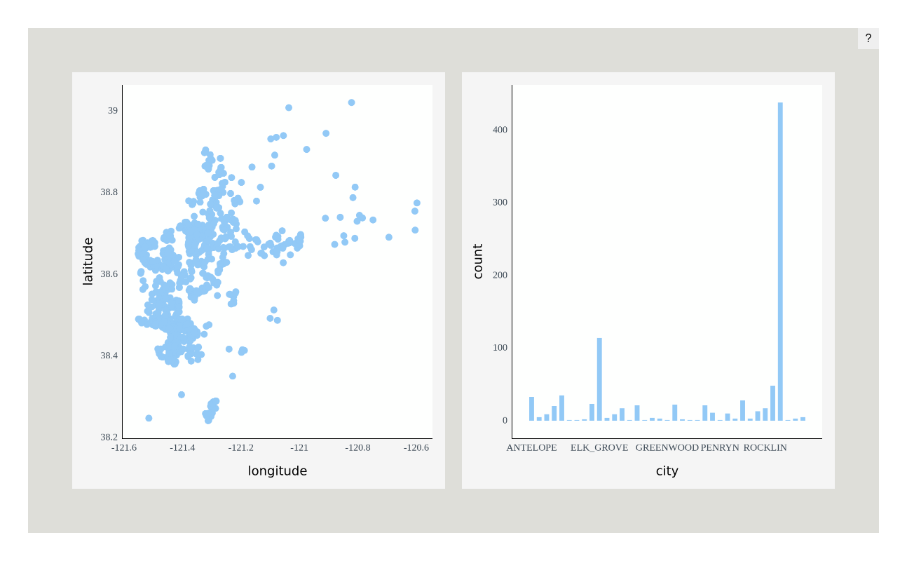
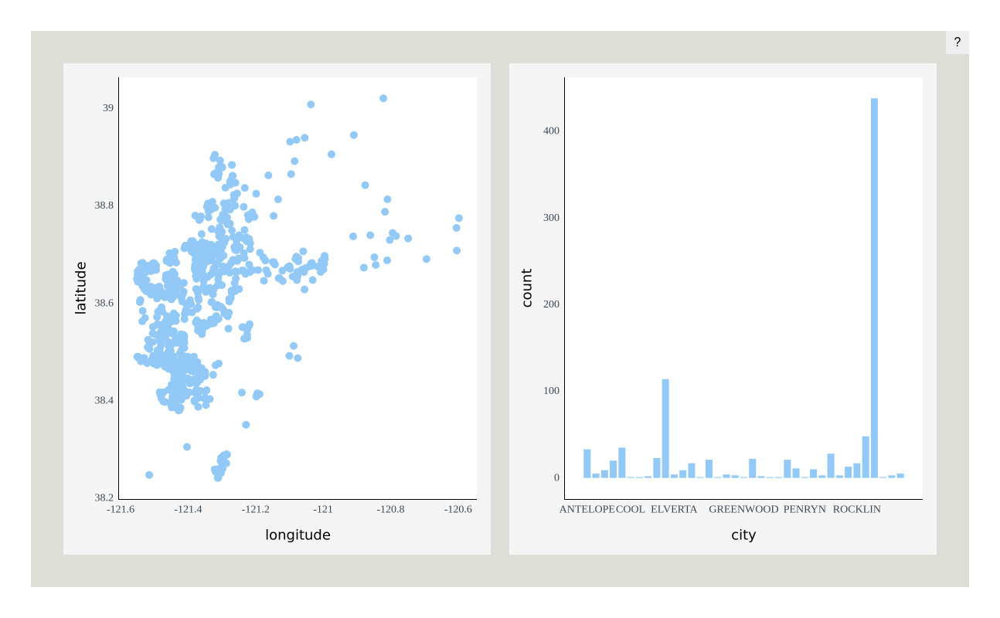
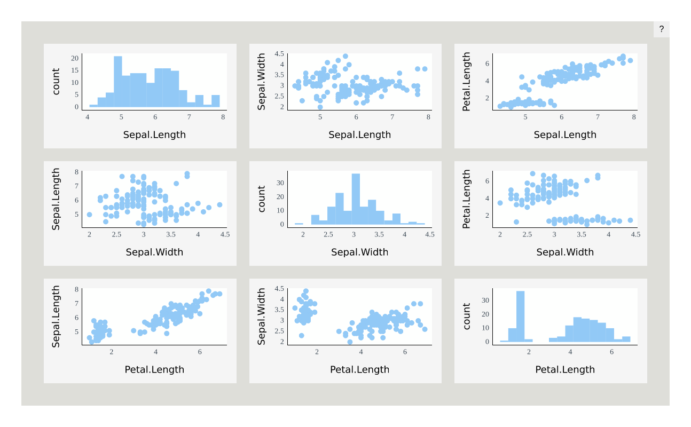
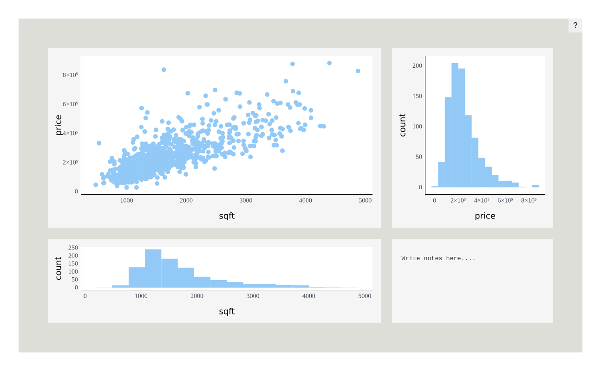
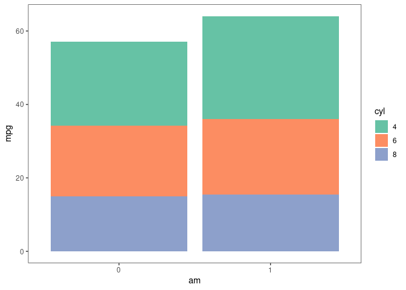
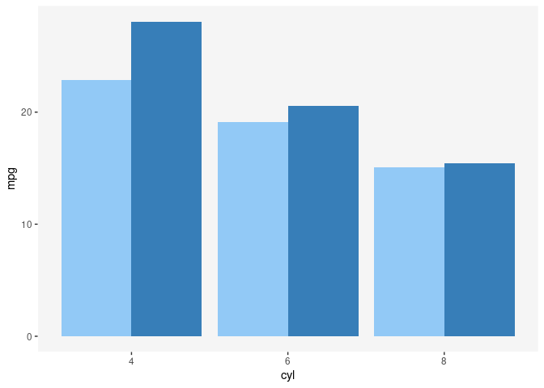
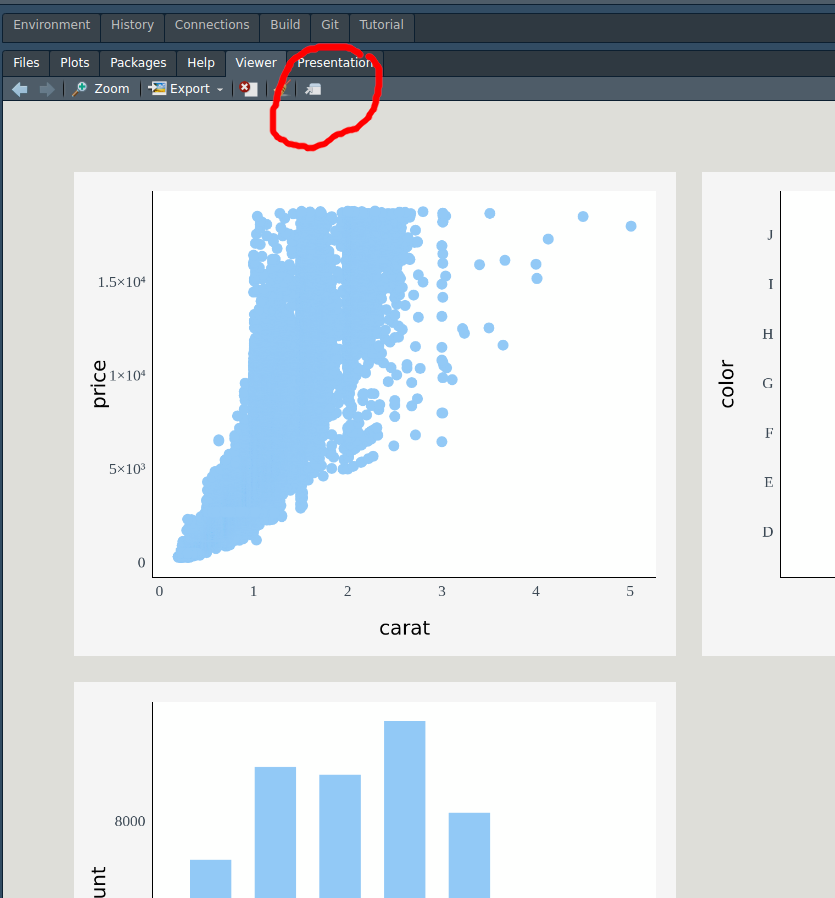

<!-- README.md is generated from README.Rmd. Please edit that file -->

# Plotscaper

<!-- badges: start -->
<!-- badges: end -->

Plotscaper is an R package designed for making interactive figures
geared towards data exploration. All plots in a `plotscaper` figure
support linked highlighting by default, and include a wide variety of
other interactions, including switching representation, changing
parameters, zooming, panning, and reordering.

## Quick start

To get started, install `plotscaper` with:

``` r
devtools::install_github("bartonicek/plotscape/packages/plotscaper")
```

Next, open up RStudio and run the following code:

``` r
library(plotscaper)
#> 
#> Attaching package: 'plotscaper'
#> The following object is masked from 'package:base':
#> 
#>     options

layout <- matrix(c(
  1, 1, 2, 3,
  1, 1, 4, 5,
  6, 7, 7, 7
), ncol = 4, byrow = TRUE)

set_scene(sacramento) |>
  add_scatterplot(c("longitude", "latitude")) |>
  add_barplot("city") |>
  add_histogram(c("sqft")) |>
  add_fluctplot(c("beds", "baths")) |>
  add_histogram2d(c("sqft", "price")) |>
  add_notes() |>
  add_parcoords(names(sacramento)) |>
  set_layout(layout)
```


In your viewer, you should now see something like the image above,
however, your version should be fully interactive (the above image is
only a static snapshot because `README.md` does not allow JavaScript).

Try moving your mouse somewhere over the big scatterplot on the top
left, clicking and dragging to select some points. You should see the
corresponding cases highlight across all the other plots!

There are many other ways interacting with `plotscaper` figures,
including:

- Zooming and panning
- Changing the size of objects
- Increasing/decreasing the opacity (alpha)
- Assigning selected cases to persistent groups
- Manipulating parameters such as histogram binwidth and anchor
- Modifying continuous axis limits
- Sorting and reordering discrete axes
- Resizing individual plots

Click on the question mark in the top right corner of the figure to see
the list of the available options plus the corresponding key/mouse
bindings.

## Anatomy of a `plotscaper` figure

There are quite a few things happening in the code to create the figure
above. Let’s walk through them piece by piece.

First, whenever we want to create a `plotscaper` figure, we need to set
up a scene object. A scene is a kind of global context into which all
plots get placed.

To set up a scene, run:

``` r
set_scene(data = sacramento)
```

where `data` is a `data.frame` object. Here we’re using the Sacramento
housing dataset from the `caret` package.

A scene on its own just shows up as an empty rectangle. To create a
proper interactive figure, we need to populate the scene with plots.
That’s what the various `add_*` functions are for:

``` r
set_scene(sacramento) |>
  add_scatterplot(c("longitude", "latitude")) |>
  add_barplot("city")
```



The code above creates interactive figure with a linked scatterplot and
a barplot. Simple as. We only need to specify which variables we want to
show in each plot by simple character vectors of their names.

Under the hood, each `plotscaper` figure is an `htmlwidgets` widget,
which means that, whenever we print the figure object, `htmlwidgets`
generates and packages up the underlying HTML and sends it to the
RStudio viewer (which is a kind of Web browser). Thus, if we run code
like below, nothing happens:

``` r
s <- set_scene(sacramento) |>
  add_scatterplot(c("longitude", "latitude")) |>
  add_barplot("city")
```

However, printing the `s` object generates the figure:

``` r
s
```



We can use this fact to generate figures programmatically using R. For
example, here’s how we could create an interactive scatterplot matrix
(SPLOM) of the `Iris` dataset:

``` r

iris_smaller <- iris[, 1:3]
keys <- names(iris_smaller)

s <- set_scene(iris_smaller)

# Loop through columns
for (i in 1:3) {
  for (j in 1:3) {
    # Add a scatterplot if row & column no.'s are different
    if (i != j) s <- s |> add_scatterplot(c(keys[i], keys[j]))
    # Add a histogram if row & column no.'s are the same
    else s <- s |> add_histogram(c(keys[i])) 
  }
}

s
```



### Layout

We can control the figure layout by using the `set_layout` function.
This function works similarly to the `layout` function from the
`graphics` package. We just give the function a matrix of numeric values
representing the plot ids, and the figure automatically resizes the
plots based on how many equal-sized rectangles in a grid each plot takes
up.

Here’s how we can create a figure with large scatterplot on the
top-left, a tall histogram on the right-hand side, a short wide
histogram on the bottom, and a small section for notes (not-(e)-plot,
pardon the pun) on the bottom-right:

``` r

layout <- matrix(c(
  1, 1, 2,
  1, 1, 2,
  3, 3, 4
), ncol = 3, byrow = TRUE)

set_scene(sacramento) |>
  add_scatterplot(c("sqft", "price")) |>
  add_histogram("price") |>
  add_histogram("sqft") |>
  add_notes() |>
  set_layout(layout)
```



It doesn’t matter when we call the `set_layout` function, as all the
important stuff happens when the HTML for the figure gets generated. The
order in which we add the plots to the scene does matter, however, as
well as the number of plots & the plot ids in the layout. If you want
the formatting to be correct, please ensure that the layout and the
number of plots you add match.

Individual plots can still be resized by pressing and holding the `S`
key and then dragging a widget in the bottom right of the plot area.
Note, however, that this feature isn’t super reliable and may result in
gaps in the layout.

## Reducers

> This section dives into the deeper properties of `plotscaper`. If you
> are happy using the default figures to explore the data, you can skip
> it, however, you may still find it an interesting read.

One of the main goals of the `plotscaper` project is to explore the ways
in which we can combine graphical objects and statistics to produce
visualizations that behave in certain consistent or “natural” ways with
interactive features such as linked selection.

### The problem

Let’s first lay out what the problem is. We’ll use the example of a
static plot constructed with `ggplot2`. Try and see if you can figure
out what’s wrong with the following plot:

``` r

library(ggplot2)
theme_set(theme_bw() + theme(panel.grid = element_blank()))

mtcars$am <- factor(mtcars$am)
mtcars$cyl <- factor(mtcars$cyl)

ggplot(mtcars, aes(x = am, y = mpg, fill = cyl)) +
  geom_bar(stat = "summary", fun = mean) +
  scale_fill_brewer(palette = "Set2")
```



Visually, this plot looks perfectly fine. However, take a closer look at
the following line:

``` r
+ geom_bar(stat = "summary", fun = mean)
```

In `ggplot2`, this means that we want to draw bars by summarizing the
y-axis variable by its average, within the levels defined by the product
of the x-axis and fill variables. However, there’s one more operation
that’s applied to the data, which is omitted from the above function
call:

``` r
+ geom_bar(stat = "summary", fun = mean, position = "stack")
```

When using using the `fill` aesthetic with `geom_bar` (as well as other
`geom`s), `ggplot2` applies the stack transformation by default. In the
case of bars, this transformation stacks the bars vertically on top of
each other, effectively summing up the heights of the coloured sub-bars.

But herein lies the problem - stacking is not just a graphical
operation. If we plot a barplot of counts or barplot of sums, then
stacking the bars vertically makes sense: sum of counts and sum of sums
are both valid overall statistics. However, “sum of averages” is a
meaningless statistic, as some data visualization experts have pointed
out:

> “Stacking is useful when the sum of the amounts represented by the
> individual stacked bars is in itself a meaningful amount” (Wilke 2019,
> 52).

> “Because this gives the visual impression of one element that is the
> sum of several others, it is very important that if the element’s size
> is used to display a statistic, then that statistic must be summable.
> Stacking bars that represent counts, sums, or percentages are fine,
> but a stacked bar chart where bars show average values is generally
> meaningless.” (Wills 2011, 112).

Alright, you might say, I cannot sum averages, but since summing sums is
fine, what if we take an average of the averages? Unfortunately,
although it may be tempting, this solution is not correct either - the
mean of group means is not the same as the grand mean:

``` r
set.seed(123456)

A <- rnorm(10)
B <- rnorm(10)
C <- rnorm(10)

# This is fine
c(sum(c(A, B, C)), sum(sum(A), sum(B), sum(C)))
#> [1] 12.31551 12.31551

# This isn't!
c(mean(c(A, B, C)), mean(mean(A), mean(B), mean(C)))
#> [1] 0.4105170 0.7934014
```

Data visualization experts have warned about this too:

> “\[…\] We do this to ensure that aggregate statistics are always
> computed over the input data, and so users do not inadvertantly
> compute e.g., averages of averages, which can easily lead to
> misinterpretation.” (Wu 2022)

So what is a data visualization practitioner to do? Those of you
familiar with `ggplot2` may have one solution ready at hand: instead of
stacking, let’s use dodging and plot the bars side by side:

``` r
ggplot(mtcars, aes(x = am, y = mpg, fill = cyl)) +
  geom_bar(stat = "summary", fun = mean, position = "dodge") +
  scale_fill_brewer(palette = "Set2")
```


This works well for static graphics, however, in interactive graphics,
this may not be a desirable solution, for several reasons. Specifically,
if we want our interactive graphics to support linked selection, then
our graphics need to be: a) selectable, and b) able to display
selections. This might seem trivial, however, it does present some
problems for dodging. For example, take a look at the following two
sequences of static plots that could represent the results of linked
selection:

``` r
library(patchwork)
theme_set(theme_bw() + theme(panel.grid = element_blank()))

set.seed(12345)
mtcars$cyl1 <- factor(mtcars$cyl)
mtcars$cyl2 <- factor(sample(mtcars$cyl))
mtcars$cyl3 <- factor(sample(mtcars$cyl))
mtcars$cyl4 <- factor(sample(mtcars$cyl))

p0 <- ggplot(mtcars, aes(am)) + 
  scale_y_continuous(breaks = seq(0, 24, by = 2), expand = c(0, 1)) +
  scale_fill_brewer(palette = "Set2") +
  labs(x = NULL, y = NULL) +
  guides(fill = "none")

p <- list()

for (i in 1:4) {
  p[[i]] <- p0 + geom_bar(aes(fill = .data[[paste0("cyl", i)]]), width = 0.75)
  p[[4 + i]] <- p0 + geom_bar(aes(fill = .data[[paste0("cyl", i)]]), 
                              position = "dodge")
}

wrap_plots(p, nrow = 2)
```



In the top row, we use stacking, and in the bottom row, dodging. Notice
that in the top row, the overall shape of the plot remains constant
throughout selection: we always have two “big bars” with constant
height, and only the heights of the coloured sub-bars change. This also
means that we always have two bars to click on or drag our mouse over to
select.

The same is not true for dodging. With dodging, since we plot the
sub-bars side-by-side, selection can affect the overall shape of the
plot dramatically - bars may shrink or grow, or even pop and in out of
existence (see second-from-left plot in the bottom row). As a further
consequence, other parts of the plot such as the axis limits may be
impacted too (see the changing upper y-axis limit in the bottom row).

In my experience, interactive figures with few objects that change
gradually are more visually appealing and easier to read than figures in
which many objects change rapidly. To be perfectly frank, I haven’t
found a great citation to support this hunch yet, but it seems clear
from basic principles of visual perception. Objects on the screen
compete for our attention, and the more there is of them, and the more
they move and jump around, the harder it may be to stay on task. From
the [Gestalt principles of visual
perception](http://www.scholarpedia.org/article/Gestalt_principles), we
know that if we want to group things visually together, we place them in
a common, closed region. This is what stacking does - by stacking, we
end up with fewer well-behaved objects to worry about.

### Reducers to the rescue

Let’s tackle the problem from a different direction. Say that we want to
stack our objects. As we have demonstrated, some types of statistics
such as sums or counts can be stacked, whereas others such as means
cannot. But what makes a statistic “stackable”?

Turns out, we can encapsulate the concept of a “stackable thing” in a
reducer. For our purposes, a reducer is a pair of functions:

- `initialfn`: An *initial* function which takes no arguments and
  produces some value
- `reducefn`: A *reduce* function which combines two values to produce a
  new one

Further, `initialfn` and `reducefn` must have the following two
properties:

``` r
reducefn(a, initialfn()) == reducefn(initialfn(), a) == a   # Unitality
reducefn(reducefn(a, b), c) == reducefn(a, reducefn(b, c))  # Associativity
```

If you’re familiar with how R’s higher-order `Reduce` function, `reduce`
/ `fold` functions from other programming languages, or if you know
something about [Monoids](https://en.wikipedia.org/wiki/Monoid), then
this should be fairly familiar. If this all looks weird to you, don’t
worry, it looked weird to me the first time I saw it too.

The important thing to grasp is that some functions can be used as
reducers and others cannot. For example, as we have shown above,
summation can be used as a reducer:

``` r
# Valid sum reducer
initialfn <- function() 0
reducefn <- function(x, y) x + y

reducefn(initialfn(), 5)
#> [1] 5

c(reducefn(1, reducefn(2, 3)),
  reducefn(reducefn(1, 2), 3)
)
#> [1] 6 6
```

Multiplication is fine as well:

``` r
# Valid product reducer
initialfn <- function() 1
reducefn <- function(x, y) x * y

reducefn(initialfn(), 5)
#> [1] 5

c(reducefn(1, reducefn(2, 3)),
  reducefn(reducefn(1, 2), 3)
)
#> [1] 6 6
```

Concatenation of strings works too:

``` r
# Valid concatenation reducer
initialfn <- function() ""
reducefn <- function(x, y) paste0(x, y)

reducefn(initialfn(), "hello")
#> [1] "hello"

c(reducefn("hello", reducefn(" ", "world")),
  reducefn(reducefn("hello", " "), "world")
)
#> [1] "hello world" "hello world"
```

But, for example, exponentiation does not work:

``` r
# Invalid exponentiation reducer
initialfn <- function() "???" # No c such that x^c == c^x == x
reducefn <- function(x, y) x^y

c(reducefn(2, reducefn(3, 2)),
  reducefn(reducefn(2, 3), 2)
)
#> [1] 512  64
```

Likewise, as we have shown previously, means don’t work either:

``` r
# Invalid mean reducer
initialfn <- function() "???" # For mean(c, x) == x, we would need c == x,
                              # but we cannot depend on x or any parameter
reducefn <- function(x, y) (x + y) / 2

c(reducefn(1, reducefn(2, 3)),
  reducefn(reducefn(1, 2), 3)
)
#> [1] 1.75 2.25
```

At this point, maybe you’re getting excited, or you still don’t see what
the point is. Either way, to get to the point, plots in `plotscaper`
support custom reducers. The only difference from the code we’ve been
writing above is that we need to write `initialfn` and `reducefn` in
JavaScript (using `htmlwidgets::JS` function), and pass it to `reducer`
(which is just a wrapper around `list`).

### Barplot of maximums

For example, here’s how we can plot a barplot of maximums:

``` r

library(htmlwidgets)

max_reducer <- reducer(
  name = "max",
  initialfn = JS("() => -Infinity"),          # max(x, -Inf) = x
  reducefn = JS("(x, y) => Math.max(x, y)")   # JavaScript's version of max
)

set_scene(sacramento) |>
  add_scatterplot(c("sqft", "price")) |>
  add_barplot(c("city", "price"), 
              options(reducer = max_reducer))
```


Since maximum is also a valid reducer, stacking behaves as expected! One
thing we have to be careful about is that, since maximums are only
weakly not strictly ordered (i.e. we have $x \leq \max(x, y)$ not
$x < \max(x, y)$), we might end up with overplotting if the maximums of
two groups are the same (at some point, I’ll try to add a way to cycle
group order to mitigate this). However, the important point is that the
overall statistics will still be correct, and the y-axis limits won’t
change with selection.

Currently, `plotscaper` only supports numeric operations as reducers,
but theoretically there’s no reason why reducers could not operate on
other types of data, such as string, dates, objects, etc…

## Performance

While `plotscaper` wasn’t designed specifically for performance, it can
perform fairly well on moderately-sized datasets (thanks largely to the
work of the super smart people who optimize the JavaScript engines like
V8, rather than any real ability on my part).

For example, if you want to put it to a stress test, try creating a
figure with the entire `diamonds` dataset from the `ggplot2` package:

``` r
set_scene(ggplot2::diamonds) |>
  add_scatterplot(c("carat", "price")) |>
  add_fluctplot(c("cut", "color")) |>
  add_barplot(c("color"))
```


With 50,000 cases, dragging to select points in the scatterplot becomes
a bit sluggish on my machine, but still fast enough to give the figure
an “interactive” rather than “slideshow” feel. Your mileage may vary.
Note that most of the slowdown is due to rendering rather than
computation - removing the scatterplot with its 50,000 points makes the
interactions a lot snappier.

Also, frustratingly, there seems to be a small slowdown when interacting
with the figure in the RStudio viewer panel rather than in the browser
window. Interestingly, this does not seem to be related to the dataset
size. I’m not very familiar with the RStudio internals and have no idea
why this might be, but for now, if you want faster interactions I
recommend just opening up a browser window, e.g. by clicking the icon in
the top right of the viewer:



(if you know the reason behind this slowdown, please email me at
<abar435@aucklanduni.ac.nz>)

Anyway, if you need fast figures with larger datasets, I recommend:

- Run the figure in the browser rather than viewer
- Use plots which summarize the data (e.g. barplots, 2D histograms),
  rather than plots which show all of the datapoints
- If everything else fails, subsample the data

<div id="refs" class="references csl-bib-body hanging-indent">

<div id="ref-wilke2019" class="csl-entry">

Wilke, Claus O. 2019. *Fundamentals of Data Visualization: A Primer on
Making Informative and Compelling Figures*. O’Reilly Media.

</div>

<div id="ref-wills2011" class="csl-entry">

Wills, Graham. 2011. *Visualizing Time: Designing Graphical
Representations for Statistical Data*. Springer Science & Business
Media.

</div>

<div id="ref-wu2022" class="csl-entry">

Wu, Eugene. 2022. “View Composition Algebra for Ad Hoc Comparison.”
*IEEE Transactions on Visualization and Computer Graphics* 28 (6):
2470–85.

</div>

</div>
