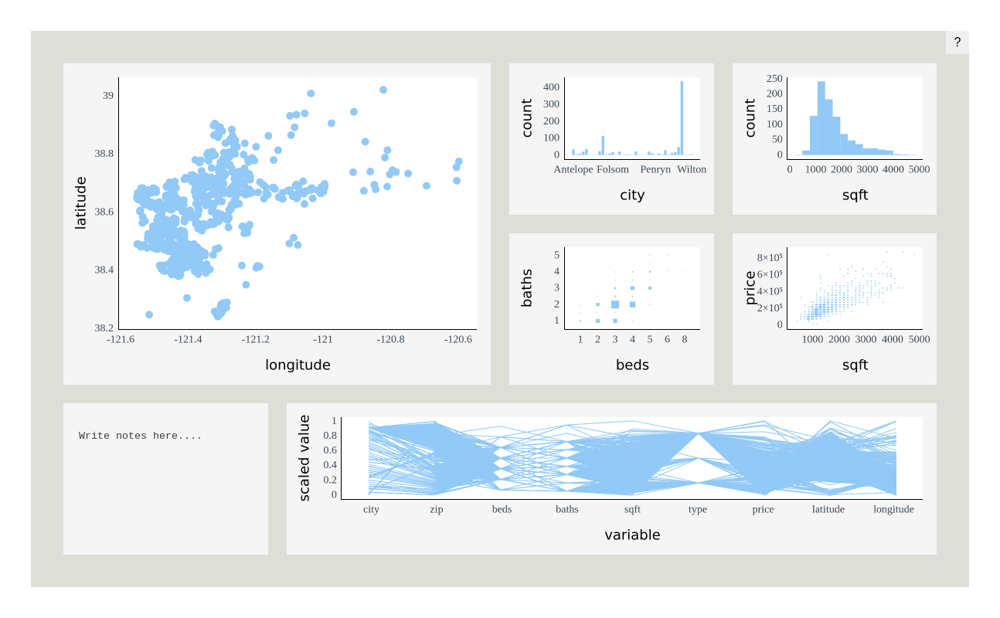

Untitled
================
Adam Bartonicek
2024-06-29

``` r
library(plotscaper)

layout <- matrix(c(
  1, 1, 2, 3,
  1, 1, 4, 5,
  6, 7, 7, 7
), ncol = 4, byrow = TRUE)

set_scene(sacramento) |>
  add_scatterplot(c("longitude", "latitude")) |>
  add_barplot("city") |>
  add_histogram(c("sqft")) |>
  add_fluctplot(c("beds", "baths")) |>
  add_histogram2d(c("sqft", "price")) |>
  add_notes() |>
  add_parcoords(names(sacramento)) |>
  set_layout(layout)
```


